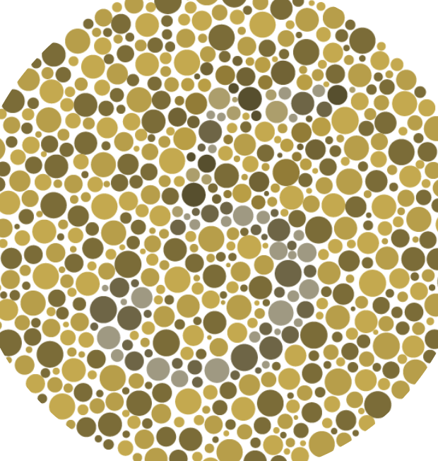
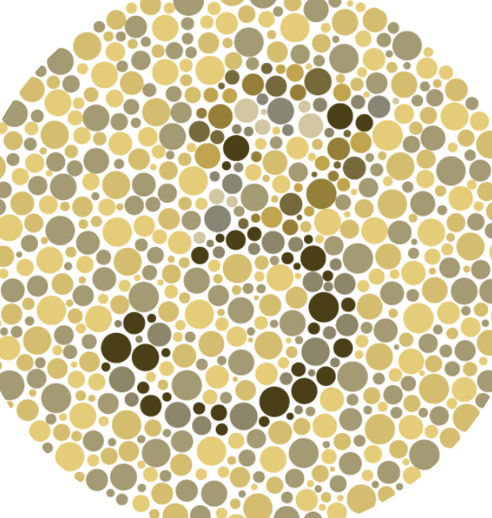

# ColorCue

## Overview
ColorCue is a Firefox browser extension that improves web accessibility by increasing color contrast on webpages. It is designed for users with color vision deficiencies (color blindness). Currently the extension supports three types of color blindness.

1. Protanopia
2. Deuteranopia
3. Tritanopia

This project originally started as a hackathon project for UCLA's QWERHacks 2024. We won second place with a working, buggy version. Since then, the team has slowly fixed and improved the project. We hope to release it as a Firefox add on and later port to other browsers.

## Usage
Currently the extension is not avaliable on the Firefox add ons marketplace. Hopefully we will finish it soon and deploy it for use. For now use [development instructions](#development) to install locally. There are still known some bugs.

## Screenshots
<!-- Keep including examples here-->
Simulated Protanopia       |  Adjusted with ColorCue
:-------------------------:|:-------------------------:
  |  

## Development
Follow [these steps](https://developer.mozilla.org/en-US/docs/Mozilla/Add-ons/WebExtensions/Your_first_WebExtension#installing) to load the extension locally.

For development, [install web-ext](https://extensionworkshop.com/documentation/develop/browser-extension-development-tools/) and run using `web-ext run` for live code reloading.

Use Firefox's [accessibility inspector](https://firefox-source-docs.mozilla.org/devtools-user/accessibility_inspector/index.html) to simulate color blindness.

## Credit
The algorithm works by utilizing a [daltonization algorithm](https://en.wikipedia.org/wiki/Color_blindness#:~:text=Some%20applications%20will%20make%20images%20easier%20to%20interpret%20by%20the%20color%20blind%20by%20enhancing%20color%20contrast%20in%20natural%20images%20and/or%20information%20graphics.%20These%20methods%20are%20generally%20called%20daltonization%20algorithms.%5B65%5D) to enhance color contrast for web page elements. The algorithm in `daltonize.js` is an updated version of Michael's algorithm from http://www.daltonize.org/2010/05/there-is-not-just-one-color-blindness.html. A direct link to the algorithm's source code can be found [here](https://galactic.ink/labs/Color-Vision/Javascript/Color.Vision.Daltonize.js).
